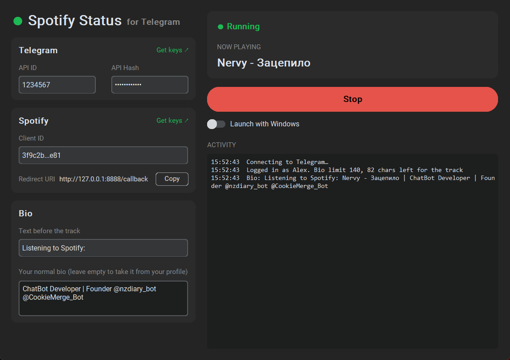

# Spotify Status for Telegram

Shows the track you're playing on Spotify as the first line of your Telegram bio, Discord-style:

```
Listening to Spotify: Nervy - Зацепило
ChatBot Developer | Founder @nzdiary_bot
```

When the music is paused or the app is closed, your normal bio comes back.



## Install

Download `SpotifyStatus.exe` from [Releases](../../releases) and put it in its own folder: settings and the login session are stored next to it.

Or run from source (Python 3.10+ with Tk):

```
pip install -r requirements.txt
python app.py
```

## Setup (once)

**Telegram API ID and Hash**
1. Go to https://my.telegram.org → *API development tools*.
2. Create an app (any name), copy `api_id` and `api_hash`.

**Spotify Client ID**
1. Go to https://developer.spotify.com/dashboard → *Create app*.
2. Add `http://127.0.0.1:8888/callback` to *Redirect URIs* and tick *Web API*.
3. Copy the *Client ID* (no secret needed).

Paste everything into the app and press **Start**.
On the first run a browser window opens to sign in to Spotify, then a QR code appears: scan it with Telegram on your phone (*Settings → Devices → Link Desktop Device*). If you use two-step verification, the app asks for that password too. No login code needed.

Leave "Your normal bio" empty to take it from your profile. Closing the window keeps the app running in the system tray (right-click the tray icon → *Quit* to exit). Turn on **Launch with Windows** to start it in the tray at login.

## Limits

- Bio is limited to 70 characters (140 with Telegram Premium). Long titles are cut.
- No track timer: Telegram rate-limits profile changes.
- Works only while the app is running.
- Windows SmartScreen may warn about the unsigned exe: *More info → Run anyway*.

## Security

`config.json` and `tg_session.session` are stored next to the app. **The session file gives full access to your Telegram account**: never share it. The app talks only to the Telegram and Spotify APIs.
